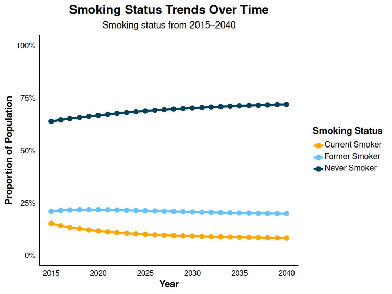
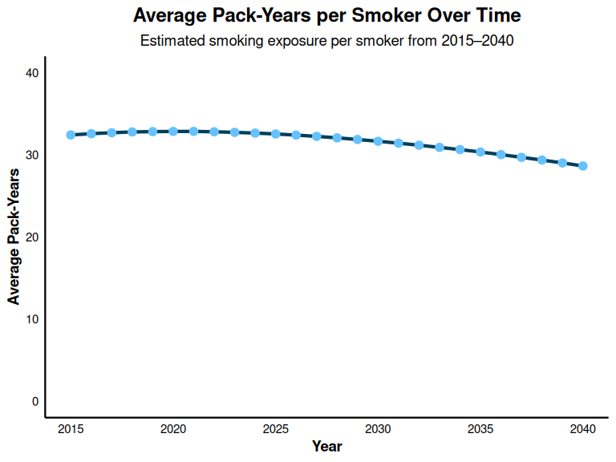

Calibrate Smoking Status
================

### Overview

This document outlines the steps taken to calibrate the model to align
with U.S.-based validation targets for smoking behavior using a 25 year
time horizon.

Validation Target: Smoking Rates: Summary Health Statistics, National
Health Interview Survey (NHIS), 2018

This section outlines the steps taken to calibrate smoking behavior and
COPD prevalence in the model to align with U.S.-based validation
targets.

Smoking Behavior Validation Targets (NHIS 2018): Current smokers: 13.8%
Former smokers: 20.9% Never smokers: 65.3%

### Step 1: Load libraries and setup

Here, we load the necessary libraries. We also set the default
simulation settings and specify the time horizon for the simulation (25
years).

``` r
library(epicUS)
library(tidyverse)
library(ggplot2)
library(scales)
library(dplyr)
library(knitr)

# Load EPIC general settings
settings <- get_default_settings()
settings$record_mode <- 0
settings$n_base_agents <- 1e6
init_session(settings = settings)
```

    ## [1] 0

``` r
input <- get_input()
time_horizon <- 26
input$values$global_parameters$time_horizon <- time_horizon
```

### Step 2: Modify intercept value to calibrate proportion of non-smokers and former smokers in the model

EPIC’s existing calibration function (from EPIC Canada) accurately
matched the overall smoking rates from the 2018 Summary Health
Statistics: National Health Interview Survey (NHIS), however, it
underestimated the proportions of never and former smokers. To address
this, we modified the intercept in the logistic regression equation that
determines the probability of being a never smoker. Increasing the
intercept to 4.85 improved alignment with the target distribution by
increasing the proportion of former smokers.

``` r
# Modify smoking rates
input$values$smoking$logit_p_never_smoker_con_not_current_0_betas<-t(as.matrix(c(intercept = 4.85, sex = 0, age = -0.06, age2 = 0,
                                                                                 sex_age = 0,sex_age2 = 0, year = -0.02)))
```

### Step 3: Modify intercept value to calibrate number of pack-years smoked in current and former smokers

EPIC’s existing calibration function (from EPIC Canada) underpredicted
the pack-years of adults who ever smoked to that reported in the
Population Assessment of Tobacco and Health (PATH) Study
(<https://pmc.ncbi.nlm.nih.gov/articles/PMC11601830/>). Data provided in
2018-2019 by the PATH Study estimated an average of 32.9 pack-years
among adults who ever smoked
(<https://pmc.ncbi.nlm.nih.gov/articles/PMC11601830/>).To address this,
we modified the intercept in the logistic regression equation that
determines pack-years of smoking at the time of creation. Increasing the
intercept to 30 improved alignment with to data from PATH.

``` r
# Modify pack years
input$values$smoking$pack_years_0_betas <- t(as.matrix(c(intercept = 30, sex = -4, age = 0, year = -0.6, current_smoker = 10)))
```

### Step 4: Modify mortality ratios for age groups

The mortality rates currently used in EPIC Canada did not include
mortality ratios for individuals under the age of 60. More recent data
from Cho et al. 2024 (DOI: 10.1056/EVIDoa2300272; Table 2) provide
age-specific mortality hazard ratios, stratified by sex. As EPIC does
not model mortality by sex, we used the midpoint of the reported male
and female estimates for each age group. For the mortality ratio for
individuals over the age of 80, we retained estimates from Gillert et
al. 2012 (DOI: 10.1001/archinternmed.2012.1397), as Cho et al.2024 did
not report data for this population.

``` r
# Modify mortality ratios for current smokers vs. non smokers
input$smoking$mortality_factor_current <- t(as.matrix(c(age40to49 = 2.33, age50to59 = 3.02, age60to69 = 2.44, age70to79 = 2.44, age80p = 1.66)))

# Modify mortality ratios for former smokers vs. non smokers
input$smoking$mortality_factor_former <- t(as.matrix(c(age40to49 = 1.31, age50to59 = 1.85, age60to69 = 1.91, age70to79 = 1.91, age80p = 1.27)))
```

### Step 5: Run EPIC

``` r
run(input = input$values)
```

    ## [1] 0

``` r
output <- Cget_output_ex()
terminate_session()
```

    ## Terminating the session

    ## [1] 0

### Step 6: Create data tables

``` r
#Calculate smoking proportions
smokingstatus_overall <- output$n_smoking_status_by_ctime
row_sums <- rowSums(smokingstatus_overall)
smokingstatus_proportions <- smokingstatus_overall / row_sums
smokingstatus_proportions <- as.data.frame(smokingstatus_proportions)

# Rename columns for readability
colnames(smokingstatus_proportions) <- c("Never Smoker", "Current Smoker", "Former Smoker")

# Add Year column
smokingstatus_proportions$Year <- 2015:2040

# Display summary of smoking status 
kable(
  smokingstatus_proportions[, c("Year", "Never Smoker", "Current Smoker", "Former Smoker")],
  caption = "Proportion of Smoking Status Over Time",
  digits = 3
  )
```

| Year | Never Smoker | Current Smoker | Former Smoker |
|-----:|-------------:|---------------:|--------------:|
| 2015 |        0.639 |          0.152 |         0.208 |
| 2016 |        0.644 |          0.142 |         0.214 |
| 2017 |        0.648 |          0.135 |         0.216 |
| 2018 |        0.653 |          0.129 |         0.218 |
| 2019 |        0.656 |          0.124 |         0.220 |
| 2020 |        0.660 |          0.120 |         0.220 |
| 2021 |        0.663 |          0.115 |         0.221 |
| 2022 |        0.667 |          0.112 |         0.221 |
| 2023 |        0.669 |          0.109 |         0.222 |
| 2024 |        0.672 |          0.106 |         0.222 |
| 2025 |        0.675 |          0.104 |         0.222 |
| 2026 |        0.677 |          0.102 |         0.221 |
| 2027 |        0.679 |          0.100 |         0.221 |
| 2028 |        0.681 |          0.098 |         0.221 |
| 2029 |        0.683 |          0.097 |         0.220 |
| 2030 |        0.685 |          0.095 |         0.220 |
| 2031 |        0.687 |          0.094 |         0.219 |
| 2032 |        0.688 |          0.093 |         0.219 |
| 2033 |        0.690 |          0.092 |         0.218 |
| 2034 |        0.691 |          0.091 |         0.218 |
| 2035 |        0.693 |          0.090 |         0.217 |
| 2036 |        0.694 |          0.090 |         0.217 |
| 2037 |        0.695 |          0.089 |         0.216 |
| 2038 |        0.696 |          0.088 |         0.216 |
| 2039 |        0.697 |          0.088 |         0.216 |
| 2040 |        0.698 |          0.087 |         0.215 |

Proportion of Smoking Status Over Time

### Step 7: Visualize data

``` r
# Reshape data for plotting
smokingstatus_reshaped<- pivot_longer(
  smokingstatus_proportions,
  cols = c("Never Smoker", "Current Smoker", "Former Smoker"),
  names_to = "Status",
  values_to = "Proportion"
  )

# Define colors
poster_colors <- c(
  "Never Smoker" = "#003f5c",      
  "Current Smoker" = "#ffa600",   
  "Former Smoker" = "#66c2ff"      
  )

# Plot smoking status trends
ggplot(smokingstatus_reshaped, aes(x = Year, y = Proportion, color = Status)) +
  geom_line(linewidth = 1.5) +
  geom_point(size = 3) +
  scale_color_manual(values = poster_colors) +
  scale_y_continuous(labels = percent_format(accuracy = 1), limits = c(0, 1)) +
  scale_x_continuous(breaks = seq(2015, 2040, by = 5)) +
  labs(
    title = "Smoking Status Trends Over Time",
    subtitle = "Smoking status from 2015–2040",
    x = "Year",
    y = "Proportion of Population",
    color = "Smoking Status"
    ) +
  theme_minimal(base_size = 14) +
  theme(
    plot.title = element_text(face = "bold", size = 18, hjust = 0.5),
    plot.subtitle = element_text(size = 14, hjust = 0.5),
    axis.title = element_text(face = "bold"),
    axis.text = element_text(color = "black"),
    axis.line = element_line(color = "black", linewidth = 0.8),
    panel.grid.major = element_blank(),
    panel.grid.minor = element_blank(),
    legend.title = element_text(face = "bold"),
    legend.text = element_text(size = 12, margin = margin(b = 4)),
    legend.key.height = unit(1.2, "lines")
    )
```

<!-- -->

### Step 8: Observe trend in pack years per person

This figure serves to assess the face validity of the simulated
trajectory of average pack-years per smoker over time. Due to the
absence of nationally representative longitudinal data on cumulative
smoking exposure (pack-years) in the United States, we rely on trends in
smoking intensity to estimate impact on pack-years.

Evidence from Cornelius et al. (2022) published in the CDC’s Morbidity
and Mortality Weekly Report (DOI: 10.15585/mmwr.mm7111a1) highlights a
sustained decline in cigarette consumption among daily smokers between
2005 and 2020. During this period:

The proportion of adults reporting consumption of 20–29 cigarettes/day
decreased from 34.9% to 27.9% Those smoking ≥30 cigarettes/day declined
from 12.7% to 6.4% Conversely, the percentage smoking 1–9 cigarettes/day
increased from 16.4% to 25.0% Those smoking 10–19 cigarettes/day rose
from 36.0% to 40.7%

These data reflect a broader shift toward lower daily cigarette
consumption, suggesting that, on average, smokers are now consuming
approximately half to one pack per day. In light of this, a projected
decline in cumulative pack-year exposure is both expected and
reasonable. The observed decrease in average pack-years per smoker in
the model is therefore aligned with empirically documented reductions in
smoking intensity, supporting the face validity of the simulated trend.

``` r
# Calculate total pack years by year
pack_years_total<- as.data.frame(output$sum_pack_years_by_ctime_sex)
pack_years_total <- rowSums(pack_years_total)
pack_years_total <- data.frame(
  Year = 2015:2040,
  packyears = pack_years_total)

# Calculate total number of current and former smokers by year

smoking_history <- as.data.frame(output$n_smoking_status_by_ctime)
smoking_history <- rowSums(smoking_history [, 2:3])
smoking_history <- data.frame(
    Year = 2015:2040,
    n_smokers = smoking_history)

# Merge datasets by year
pack_years_total_and_smoking_history <- merge(pack_years_total, smoking_history, by = "Year")

# Calculate average pack-years 
pack_year_per_person <- data.frame(
  Year = pack_years_total_and_smoking_history$Year,
  AvgPackYearsPerSmoker = pack_years_total_and_smoking_history$packyears / pack_years_total_and_smoking_history$n_smokers
  )

#
```

### Step 9: Visualize trend in pack years per person

``` r
ggplot(pack_year_per_person, aes(x = Year, y = AvgPackYearsPerSmoker)) +
  geom_line(linewidth = 1.5, color = "#003f5c") +           
  geom_point(size = 3, color = "#66c2ff", stroke = 0.8) +  
  scale_y_continuous(
    labels = scales::comma_format(accuracy = 1),
    limits = c(0, 40)
    ) +
  scale_x_continuous(breaks = seq(2015, 2040, by = 5)) +
  labs(
    title = "Average Pack-Years per Smoker Over Time",
    subtitle = "Estimated smoking exposure per smoker from 2015–2040",
    x = "Year",
    y = "Average Pack-Years"
    ) +
  theme_minimal(base_size = 14) +
  theme(
    plot.title = element_text(face = "bold", size = 18, hjust = 0.5, margin = margin(b = 8)),
    plot.subtitle = element_text(size = 14, hjust = 0.5),
    axis.title = element_text(face = "bold"),
    axis.text = element_text(color = "black"),
    axis.line = element_line(color = "black", linewidth = 0.8),
    panel.grid.major = element_blank(),
    panel.grid.minor = element_blank()
    )
```

<!-- -->

### 
