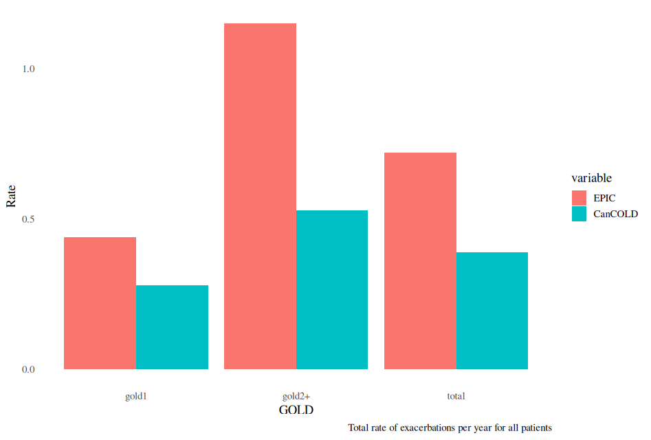
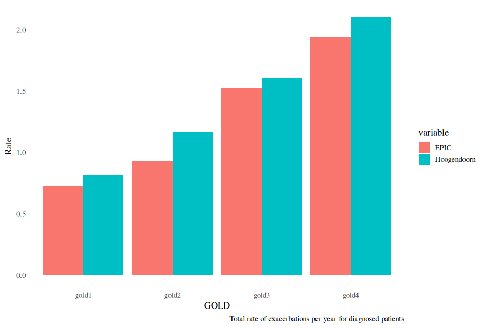
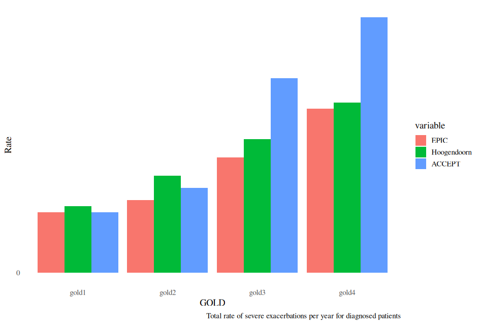
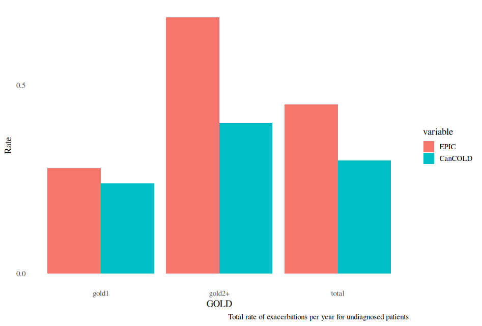

Calibrate COPD Exacerbations
================

### Overview

This document outlines the calibration process undertaken to align the
model’s outputs with validation targets for COPD exacerbations, using
the ACCEPT study, Hoogendorn et al 2021, and CanCOLD.

## Calibration of COPD Exacerbation Rates

This section outlines the internal validation process conducted to align
the model’s simulated COPD exacerbation rates with empirical targets
drawn from key reference studies. The validation focused on both
diagnosed and undiagnosed populations and was stratified by GOLD stage
and exacerbation severity (total, moderate/severe, and severe only).
Detailed validation targets and associated calibration code are
presented below.

**Validation References:**

- Hoogendoorn et al. 2021 (DOI: 10.1183/09031936.00043710)
- ACCEPT study (DOI: 10.1016/S2213-2600(19)30397-2)  
- CanCOLD study (DOI: 10.3109/15412555.2012.665520)

------------------------------------------------------------------------

### **Validation Targets**

#### **Diagnosed Patients – Total Exacerbation Rate (Hoogendoorn et al. 2021)**

Simulated rates were compared against those reported by Hoogendoorn et
al. 2021: - **GOLD 1:** 0.82  
- **GOLD 2:** 1.17  
- **GOLD 3:** 1.61  
- **GOLD 4:** 2.10

#### **Diagnosed Patients – Moderate and Severe Exacerbation Rates (ACCEPT Study)**

The ACCEPT study provided target rates for moderate and severe
exacerbations: - **GOLD 1:** 0.58  
- **GOLD 2:** 0.91  
- **GOLD 3:** 1.41  
- **GOLD 4:** 1.69

#### **Diagnosed Patients – Severe Exacerbation Rates**

Two comparator sources were used:  
- **Hoogendoorn et al. 2021**  
- GOLD 1–4: 0.11, 0.16, 0.22, 0.28  
- **ACCEPT Study**  
- GOLD 1–4: 0.10, 0.14, 0.32, 0.42

#### **Undiagnosed Patients – Total Exacerbation Rate (CanCOLD)**

For the undiagnosed subgroup, exacerbation rates were benchmarked
against CanCOLD data: - **Total population:** 0.30  
- **GOLD 1:** 0.24  
- **GOLD 2+:** 0.40

#### **Overall and GOLD-Stratified Total Exacerbation Rates (CanCOLD)**

For all individuals (diagnosed and undiagnosed), total exacerbation
rates per year were compared against the CanCOLD study benchmarks: -
**Total population:** 0.39  
- **GOLD 1:** 0.28  
- **GOLD 2+:** 0.53

------------------------------------------------------------------------

The calibration code below performs the relevant calculations and
visualizations for each validation target.

### Calibrate COPD exacerbations

``` r
library(tidyverse)
library(epicUS)
library(ggthemes)
library(scales)
library(ggplot2)
library(dplyr)
library(tidyr)
library(reshape2)

# Load EPIC general settings
settings <- get_default_settings()
settings$record_mode <- 2
settings$n_base_agents <- 3.5e6
init_session(settings = settings)
```

    ## Initializing the session

    ## [1] 0

``` r
input <- get_input()
time_horizon <- 26

# Modify intercept value to calibrate proportion of COPD exacerbations
input$values$exacerbation$ln_rate_betas <- t(as.matrix(c(intercept = 2.0, female = 0, age = 0.04082 * 0.1, fev1 = -1.5, smoking_status = 0.7, gold1 = 0.15 , gold2 = -0.10 , gold3 = -0.40 , gold4 = -0.75 , diagnosis_effect = 0)))
input$values$exacerbation$logit_severity_betas = t(as.matrix(c(intercept1 = -2.809, intercept2 = 2.402, intercept3 = 3.808, female = -0.764, age = -0.007, fev1 = 0.98, smoking_status = 0.348, pack_years = -0.001 , BMI = 0.018)))

# Load EPIC general settings
run(input = input$values)
```

    ## ERROR:ERR_EVENT_STACK_FULL

    ## [1] -4

``` r
op <- Cget_output()
output_ex <- Cget_output_ex()

all_events <- as.data.frame(Cget_all_events_matrix())
  exac_events <- subset(all_events, event == 5)
  exit_events <- subset(all_events, event == 14)

  Follow_up_GOLD <- c(0, 0, 0, 0)
  last_GOLD_transition_time <- 0
  for (i in 2:dim(all_events)[1]) {
    if (all_events[i, "id"] != all_events[i - 1, "id"])
      last_GOLD_transition_time <- 0
    if ((all_events[i, "id"] == all_events[i - 1, "id"]) & (all_events[i, "gold"] != all_events[i - 1, "gold"])) {
      Follow_up_GOLD[all_events[i - 1, "gold"]] = Follow_up_GOLD[all_events[i - 1, "gold"]] + all_events[i - 1, "followup_after_COPD"] -
        last_GOLD_transition_time
      last_GOLD_transition_time <- all_events[i - 1, "followup_after_COPD"]
    }
    if (all_events[i, "event"] == 14)
      Follow_up_GOLD[all_events[i, "gold"]] = Follow_up_GOLD[all_events[i, "gold"]] + all_events[i, "followup_after_COPD"] -
        last_GOLD_transition_time
  }


  #----------------------------DIAGNOSED ------------------------------------
  #-------------------------------------------------------------------------

  all_events_diagnosed          <- subset(all_events, diagnosis > 0 & gold > 0 )
  exac_events_diagnosed         <- subset(all_events_diagnosed, event == 5 )
  sev_exac_events_diagnosed    <- subset(all_events_diagnosed, event == 5 & (exac_status == 3 | exac_status == 4) )
  mod_sev_exac_events_diagnosed <- subset(all_events_diagnosed, event == 5 & (exac_status == 3 | exac_status == 4 | exac_status == 2) )
  exit_events_diagnosed         <- subset(all_events_diagnosed, event == 14)

  Follow_up_GOLD_diagnosed <- c(0, 0, 0, 0)
  last_GOLD_transition_time_diagnosed <- 0
  for (i in 2:dim(all_events_diagnosed)[1]) {
    if ((all_events_diagnosed[i, "id"] != all_events_diagnosed[i - 1, "id"]))
      last_GOLD_transition_time_diagnosed <- 0
    if ((all_events_diagnosed[i, "id"] == all_events_diagnosed[i - 1, "id"]) & (all_events_diagnosed[i, "gold"] != all_events_diagnosed[i - 1, "gold"])) {
      Follow_up_GOLD_diagnosed[all_events_diagnosed[i - 1, "gold"]] = Follow_up_GOLD_diagnosed[all_events_diagnosed[i - 1, "gold"]] + (all_events_diagnosed[i - 1, "local_time"]-all_events_diagnosed[i - 1, "time_at_diagnosis"]) -
        last_GOLD_transition_time_diagnosed
      last_GOLD_transition_time_diagnosed <- (all_events_diagnosed[i - 1, "local_time"]-all_events_diagnosed[i - 1, "time_at_diagnosis"])
    }
    if (all_events_diagnosed[i, "event"] == 14)
      Follow_up_GOLD_diagnosed[all_events_diagnosed[i, "gold"]] = Follow_up_GOLD_diagnosed[all_events_diagnosed[i, "gold"]] + (all_events_diagnosed[i, "local_time"]-all_events_diagnosed[i, "time_at_diagnosis"]) -
        last_GOLD_transition_time_diagnosed
  }

  #----------------------------UNDIAGNOSED ------------------------------------
  #-------------------------------------------------------------------------

  all_events_undiagnosed          <- subset(all_events, diagnosis == 0 & gold > 0 & gold < 3) #CanCOLD is only GOLD 1 and 2
  exac_events_undiagnosed         <- subset(all_events_undiagnosed, event == 5 )
  sev_exac_events_undiagnosed     <- subset(all_events_undiagnosed, event == 5 & (exac_status == 3 | exac_status == 4) )
  mod_sev_exac_events_undiagnosed <- subset(all_events_undiagnosed, event == 5 & (exac_status == 3 | exac_status == 4 | exac_status == 2) )
  exit_events_undiagnosed         <- subset(all_events_undiagnosed, event == 14)

  Follow_up_GOLD_undiagnosed <- c(0, 0, 0, 0)
  last_GOLD_transition_time_undiagnosed <- 0
  for (i in 2:dim(all_events_undiagnosed)[1]) {
    if ((all_events_undiagnosed[i, "id"] != all_events_undiagnosed[i - 1, "id"]))
      last_GOLD_transition_time_undiagnosed <- 0
    if ((all_events_undiagnosed[i, "id"] == all_events_undiagnosed[i - 1, "id"]) & (all_events_undiagnosed[i, "gold"] != all_events_undiagnosed[i - 1, "gold"])) {
      Follow_up_GOLD_undiagnosed[all_events_undiagnosed[i - 1, "gold"]] = Follow_up_GOLD_undiagnosed[all_events_undiagnosed[i - 1, "gold"]] + (all_events_undiagnosed[i - 1, "local_time"]-all_events_undiagnosed[i - 1, "time_at_diagnosis"]) -
        last_GOLD_transition_time_undiagnosed
      last_GOLD_transition_time_undiagnosed <- (all_events_undiagnosed[i - 1, "local_time"]-all_events_undiagnosed[i - 1, "time_at_diagnosis"])
    }
    if (all_events_undiagnosed[i, "event"] == 14)
      Follow_up_GOLD_undiagnosed[all_events_undiagnosed[i, "gold"]] = Follow_up_GOLD_undiagnosed[all_events_undiagnosed[i, "gold"]] + (all_events_undiagnosed[i, "local_time"]-all_events_undiagnosed[i, "time_at_diagnosis"]) -
        last_GOLD_transition_time_undiagnosed
  }

  terminate_session()
```

    ## Terminating the session

    ## [1] 0

``` r
  #----------------------------All ------------------------------------
  #-------------------------------------------------------------------------

  message("Exacerbation Rates per GOLD stages for all patients:")
```

    ## Exacerbation Rates per GOLD stages for all patients:

``` r
  GOLD_I   <- (as.data.frame(table(exac_events[, "gold"]))[1, 2]/Follow_up_GOLD[1])
  GOLD_II  <- (as.data.frame(table(exac_events[, "gold"]))[2, 2]/Follow_up_GOLD[2])
  GOLD_III <- (as.data.frame(table(exac_events[, "gold"]))[3, 2]/Follow_up_GOLD[3])
  GOLD_IV  <- (as.data.frame(table(exac_events[, "gold"]))[4, 2]/Follow_up_GOLD[4])

  message(paste0("exacRateGOLDI   = ", round(GOLD_I  , 2)))
```

    ## exacRateGOLDI   = 0.49

``` r
  message(paste0("exacRateGOLDII  = ", round(GOLD_II , 2)))
```

    ## exacRateGOLDII  = 0.84

``` r
  message(paste0("exacRateGOLDIII = ", round(GOLD_III, 2)))
```

    ## exacRateGOLDIII = 1.29

``` r
  message(paste0("exacRateGOLDIV  = ", round(GOLD_IV , 2)))
```

    ## exacRateGOLDIV  = 1.69

``` r
  #----------------------------All ------------------------------------
  #-------------------------------------------------------------------------
  total_rate <- round(nrow(exac_events)/sum(Follow_up_GOLD), 2)
  Exac_per_GOLD <- matrix (NA, nrow = 3, ncol =3)
  colnames(Exac_per_GOLD) <- c("GOLD", "EPIC", "CanCOLD")
  # CanCOLD only available for GOLD 1 and 2. See doi: 10.1164/rccm.201509-1795OC

  Follow_up_GOLD_all_2level <- c(Follow_up_GOLD[1], Follow_up_GOLD[2]) # Because CanCOLD is mostly GOLD2, here we compare EPIC's GOLD2 only instead of GOLD2+
  #  Follow_up_GOLD_all_2level <- c(Follow_up_GOLD[1], sum(Follow_up_GOLD[2:4]))
  GOLD_counts_all       <- as.data.frame(table(exac_events[, "gold"]))[, 2]
  GOLD_counts_all       <- c(GOLD_counts_all[1], sum(GOLD_counts_all[2:4]))

  Exac_per_GOLD[1:3, 1] <- c("total", "gold1", "gold2+")
  Exac_per_GOLD[1:3, 2] <- c(total_rate,
                             round(x=GOLD_counts_all/Follow_up_GOLD_all_2level,
                                   digit = 2))
  Exac_per_GOLD[1:3, 3] <- c(0.39, 0.28, 0.53)

  df <- as.data.frame(Exac_per_GOLD)
  dfm <- melt(df[,c("GOLD", "EPIC", "CanCOLD")],id.vars = 1)
  plot <-
    ggplot(dfm, aes(x = GOLD, y = as.numeric(value))) +
    scale_y_continuous(breaks = seq(0, 3, by = 0.5)) +
    theme_tufte(base_size=14, ticks=F)  +
    geom_bar(aes(fill = variable), stat = "identity", position = "dodge") +
    ylab ("Rate") +
    labs(caption = "Total rate of exacerbations per year for all patients")

  print(plot)
```

<!-- -->

``` r
  #--------------------------- total number of severe exacerbations:

  n_exac <- data.frame(year= 1:20,Severe_Exacerbations = (output_ex$n_exac_by_ctime_severity[,3]+output_ex$n_exac_by_ctime_severity[,4])* (100000/rowSums(output_ex$n_alive_by_ctime_sex)))
  avgRate_sevExac <- mean(n_exac$Severe_Exacerbations[round(nrow(n_exac)/2,0):nrow(n_exac)])
  avgRate_sevExac <- round(avgRate_sevExac, 2)
  message(paste0("Average rate during 20 years: ", avgRate_sevExac))
```

    ## Average rate during 20 years: 757.41

``` r
  rate2017_sevExac <-(output_ex$n_exac_by_ctime_severity[3,3]+output_ex$n_exac_by_ctime_severity[3,4])*(100000/sum(output_ex$n_alive_by_ctime_sex[3,]))
  rate2017_sevExac <- round(rate2017_sevExac, 2)
  message(paste0("Rate in 2017: ", rate2017_sevExac))
```

    ## Rate in 2017: 490.88

``` r
  #----------------------------Diagnosed ------------------------------------
  #-------------------------------------------------------------------------

  Exac_per_GOLD_diagnosed <- matrix (NA, nrow = 4, ncol = 3)
  colnames(Exac_per_GOLD_diagnosed) <- c("GOLD", "EPIC", "Hoogendoorn")
  # ACCEPT data is rates from a join of ECLIPSE, MACRO, OPTIMAL and STATCOPE.
  Exac_per_GOLD_diagnosed[1:4, 1] <- c("gold1", "gold2", "gold3", "gold4")
  Exac_per_GOLD_diagnosed[1:4, 2] <- round(
    x=as.data.frame(table(exac_events_diagnosed[, "gold"]))[, 2]/
      Follow_up_GOLD_diagnosed, digit = 2)
  Exac_per_GOLD_diagnosed[1:4, 3] <- c(0.82, 1.17, 1.61, 2.10)

  df <- as.data.frame(Exac_per_GOLD_diagnosed)
  dfm <- melt(df[,c("GOLD", "EPIC", "Hoogendoorn")],id.vars = 1)
  plot <- ggplot(dfm, aes(x = GOLD, y = as.numeric(value))) +
    scale_y_continuous(breaks = seq(0, 3, by = 0.5)) +
    theme_tufte(base_size=14, ticks=F)  +
    geom_bar(aes(fill = variable), stat = "identity", position = "dodge") +
    ylab ("Rate") +
    labs(caption = "Total rate of exacerbations per year for diagnosed patients")
  print(plot)
```

<!-- -->

``` r
  message("Total rate of exacerbation in diagnosed patients (1.5 per year in Hoogendoorn): ", round(nrow(exac_events_diagnosed)/sum(Follow_up_GOLD_diagnosed), 2))
```

    ## Total rate of exacerbation in diagnosed patients (1.5 per year in Hoogendoorn): 1.1

``` r
  #----------------------------Diagnosed Moderate and Severe------------------------------------
  #-------------------------------------------------------------------------

  Exac_per_GOLD_diagnosed <- matrix (NA, nrow = 4, ncol = 3)
  colnames(Exac_per_GOLD_diagnosed) <- c("GOLD", "EPIC", "ACCEPT")
  # ACCEPT data is rates from a join of ECLIPSE, MACRO, OPTIMAL and STATCOPE.
  Exac_per_GOLD_diagnosed[1:4, 1] <- c("gold1", "gold2", "gold3", "gold4")
  Exac_per_GOLD_diagnosed[1:4, 2] <- round(
    x=as.data.frame(table(mod_sev_exac_events_diagnosed[, "gold"]))[, 2]/
      Follow_up_GOLD_diagnosed, digit = 2)
  Exac_per_GOLD_diagnosed[1:4, 3] <- c(0.58, 0.91, 1.41, 1.69)

  df <- as.data.frame(Exac_per_GOLD_diagnosed)
  dfm <- melt(df[,c("GOLD", "EPIC", "ACCEPT")],id.vars = 1)
  plot <-
    ggplot(dfm, aes(x = GOLD, y = as.numeric(value))) +
    scale_y_continuous(breaks = seq(0, 3, by = 0.5)) +
    theme_tufte(base_size=14, ticks=F)  +
    geom_bar(aes(fill = variable), stat = "identity", position = "dodge") +
    ylab ("Rate") +
    labs(caption = "Total rate of moderate/severe exacerbations per year for diagnosed patients")

  print(plot)
```

<!-- -->

``` r
  #----------------------------Diagnosed Severe------------------------------------
  #-------------------------------------------------------------------------

  Exac_per_GOLD_diagnosed <- matrix (NA, nrow = 4, ncol = 4)
  colnames(Exac_per_GOLD_diagnosed) <- c("GOLD", "EPIC", "Hoogendoorn", "ACCEPT")
  # ACCEPT data is rates from a join of ECLIPSE, MACRO, OPTIMAL and STATCOPE.
  Exac_per_GOLD_diagnosed[1:4, 1] <- c("gold1", "gold2", "gold3", "gold4")
  Exac_per_GOLD_diagnosed[1:4, 2] <- round(
    x=as.data.frame(table(sev_exac_events_diagnosed[, "gold"]))[, 2]/
      Follow_up_GOLD_diagnosed, digit = 2)

  Exac_per_GOLD_diagnosed[1:4, 3] <- c(0.11, 0.16, 0.22, 0.28)
  Exac_per_GOLD_diagnosed[1:4, 4] <- c(0.10, 0.14, 0.32, 0.42)

  df <- as.data.frame(Exac_per_GOLD_diagnosed)
  dfm <- melt(df[,c("GOLD", "EPIC", "Hoogendoorn", "ACCEPT")],id.vars = 1)
  plot <-
    ggplot(dfm, aes(x = GOLD, y = as.numeric(value))) +
    scale_y_continuous(breaks = seq(0, 3, by = 0.5)) +
    theme_tufte(base_size=14, ticks=F)  +
    geom_bar(aes(fill = variable), stat = "identity", position = "dodge") +
    ylab ("Rate") +
    labs(caption = "Total rate of severe exacerbations per year for diagnosed patients")

  print(plot)
```

<!-- -->

``` r
  #----------------------------Undiagnosed ------------------------------------
  #----------------------------------------------------------------------------
  total_rate_undiagnosed <- round(nrow(exac_events_undiagnosed)/sum(Follow_up_GOLD_undiagnosed), 2)
  Exac_per_GOLD_undiagnosed <- matrix (NA, nrow = 3, ncol = 3)
  colnames(Exac_per_GOLD_undiagnosed) <- c("GOLD", "EPIC", "CanCOLD")
  Exac_per_GOLD_undiagnosed[1:3, 1] <- c("total", "gold1", "gold2+")

  Follow_up_GOLD_undiagnosed_2level <- c(Follow_up_GOLD_undiagnosed[1],
                                         Follow_up_GOLD_undiagnosed[2]) #Because CANCold is mostly GOLD2, we comprare to GOLD2 EPIC
  #Follow_up_GOLD_undiagnosed_2level <- c(Follow_up_GOLD_undiagnosed[1], sum(Follow_up_GOLD_undiagnosed[2:4]))
  GOLD_counts_undiagnosed   <- as.data.frame(table(exac_events_undiagnosed[, "gold"]))[, 2]
  GOLD_counts_undiagnosed   <- c(GOLD_counts_undiagnosed[1],
                                 GOLD_counts_undiagnosed[2])


  Exac_per_GOLD_undiagnosed[1:3, 2] <- c(total_rate_undiagnosed,
                                         round(x=GOLD_counts_undiagnosed/Follow_up_GOLD_undiagnosed_2level, digit = 2))
  Exac_per_GOLD_undiagnosed[1:3, 3] <- c(0.30, 0.24, 0.40)

  df <- as.data.frame(Exac_per_GOLD_undiagnosed)
  dfm <- melt(df[,c("GOLD", "EPIC", "CanCOLD")],id.vars = 1)
  plot <-
    ggplot(dfm, aes(x = GOLD, y = as.numeric(value))) +
    scale_y_continuous(breaks = seq(0, 3, by = 0.5)) +
    theme_tufte(base_size=14, ticks=F)  +
    geom_bar(aes(fill = variable), stat = "identity", position = "dodge") +
    ylab ("Rate") +
    labs(caption = "Total rate of exacerbations per year for undiagnosed patients")
  print(plot)
```

<!-- -->

``` r
  message("Total rate of exacerbation in undiagnosed patients (0.30 per year in CanCOLD): ",
          total_rate_undiagnosed)
```

    ## Total rate of exacerbation in undiagnosed patients (0.30 per year in CanCOLD): 0.51
